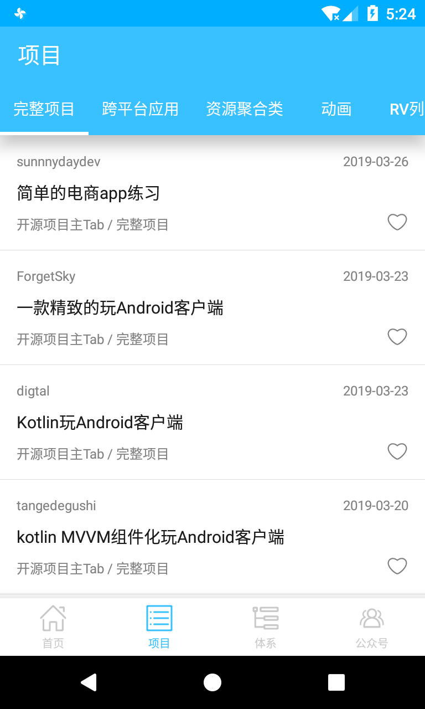
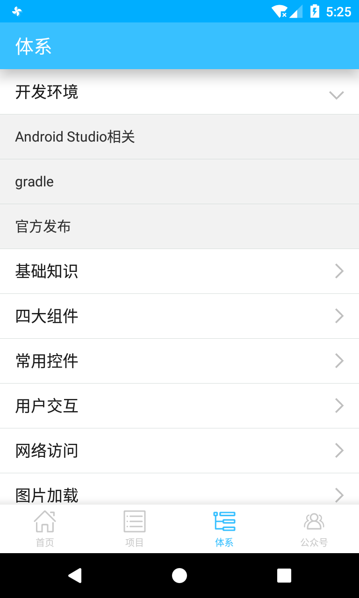
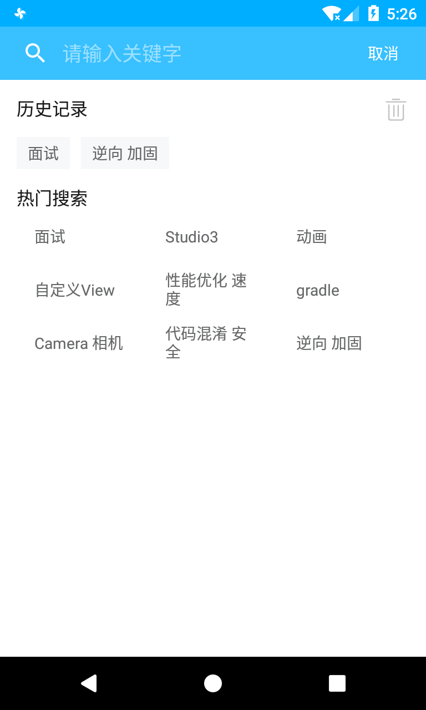
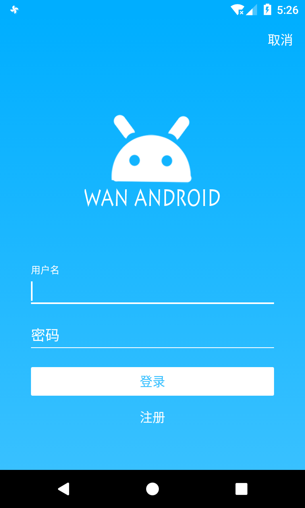

### WanAndroid
---

玩Android 的又双叒叕一个客户端  
使用 Kotlin 编写  
话不多说，先上图  

  
  
  
  
  
  

个人感觉界面还是比较清新简洁的，哈哈
  
---
**下载地址：**  

  

[下载链接](http://app-global.pgyer.com/fc3027a17bf4e03342fd500dfdbf9968.apk?attname=XgWanAndroid.apk&sign=952c9c292bbd5c442efeeb4fe5d93ff0&t=5ca09ae1)

---
**自我感觉良好的地方**  

1. 使用 OkHttp 的 CookieJar 来处理 Cookie。  
2. 搜索页面包含三个部分：历史搜索，热门搜索和搜索结果。分别使用了三个 Fragment 来处理这三个方面的逻辑。
这样一来就可以极大的简化了 SearchActivity 的逻辑，而且还可以把这三个部分封装成独立的组件。
这个灵感来自知乎的开源项目 [Matisse](https://github.com/zhihu/Matisse)，该图片选择器的图片列表部分
使用的就是 Fragment，每当切换相册时，就会将 Fragment 销毁然后加载新的相册中的图片。  

该项目还在持续更新中，包括增加新的功能和完善/优化一些逻辑。